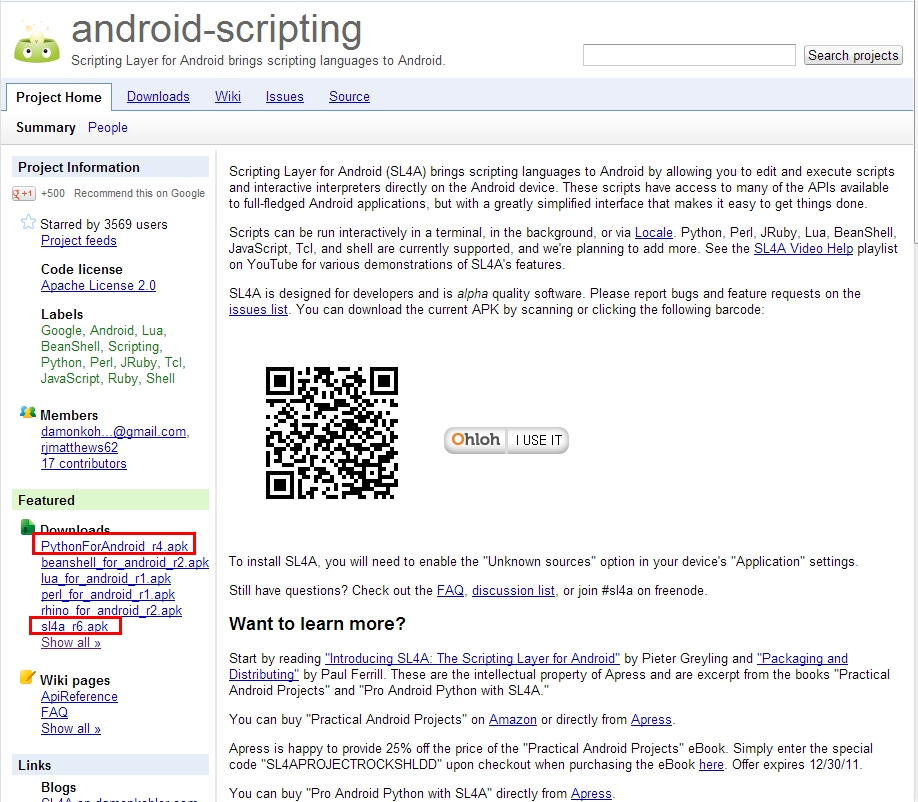
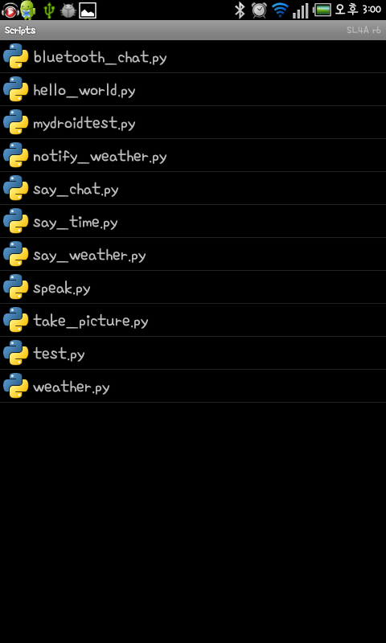
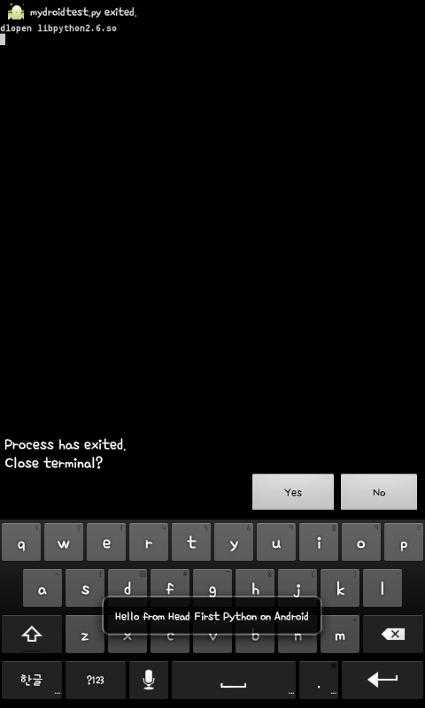
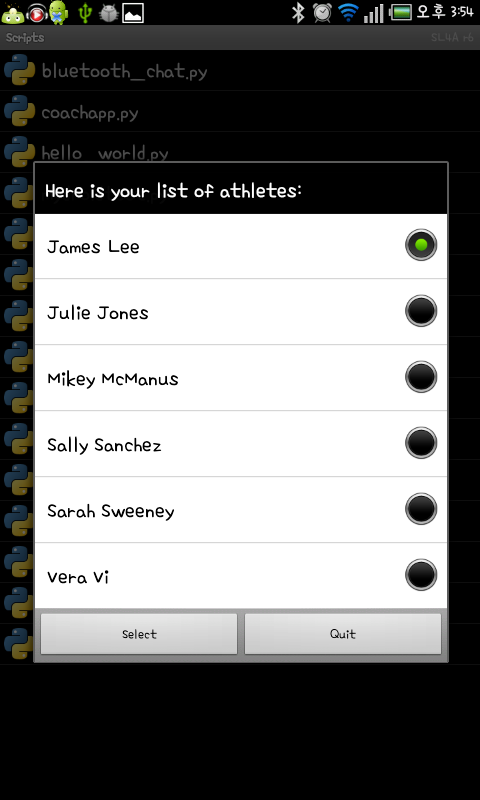
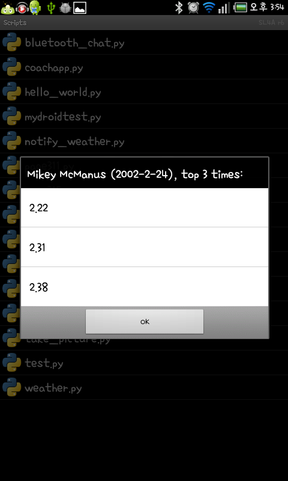

# 8. 모바일 앱 개발 

## 1. Android 개발 환경 setting 은 생략 하도록 하겠습니다.(eclipse 설치, adt 등등)
 - http://developer.android.com/sdk/index.html 참고

## 2. 파이썬을 Android Phone 에서 실행하기 
 - Scripting Layer for Android(SL4A) 프로젝트(BeanShell, JRuby, Lua, PHP, Perl, Python, Rhino) 를 활용 하여 개발
 - 책에는 python 2에서만 동작 하도록 되어 있다고 기술 되어 있으나 https://code.google.com/p/python-for-android/ 프로젝트에서 3을 지원한다고 합니다.(Beta)
 - 개발에 관한 부가적인 api 는 http://code.google.com/p/android-scripting/wiki/ApiReference 참고

### 설치
 1. http://code.google.com/p/android-scripting 에서 apk 를 받아서 설치
    
 2.  python for android 설치

  * 1의 url 에서 download tab 에 가서 설치 하는 방법
  * app 내에서 실행하는 방법(메뉴->Interpreters, 메뉴->add->python 클릭시 자동으로 download)
 
## 3. 개발 해보기

### sample 

mydroidtest.py

      import android
      app = android.Android()
      msg = "Hello from Head First Python on Android"
      app.makeToast(msg)

    -> cmd 창에서 :    adb push "filename" /sbcard/sl4a/scripts/



   
### json 을 통한 서버의 통신 프로그램 개발

generate_names.py

```

	import json
	import athletemodel
	import yate
	names = athletemodel.get_names_from_store()
	print(yate.start_response('application/json' ))
	print(json.dumps(sorted(names)))
	
	```
	
generate_data.py
	
	```
	import glob
	
	import athletemodel
	import yate
	
	data_files = glob.glob("data/*.txt")
	athletes = athletemodel.put_to_store(data_files)
	
	print(yate.start_response())
	print(yate.include_header("Coach Kelly's List of Athletes"))
	print(yate.start_form("generate_timing_data.py"))
	print(yate.para("Select an athlete from the list to work with:"))
	for each_athlete in sorted(athletes):
	    print(yate.radio_button( "which_athlete", athletes[each_athlete].name))
	print(yate.end_form("Select"))
	print(yate.include_footer({"Home": "/index.html"}))

```

test : http://localhost:8080/cgi-bin/generate_names.py

### client 프로그램


coachapp.py


	import android
	import json
	import time
	
	from urllib import urlencode
	from urllib2 import urlopen
	
	hello_msg = "Welcome to Coach Kelly's Timing App"
	list_title = 'Here is your list of athletes:'
	quit_msg = "Quitting Coach Kelly's App."
	web_server = 'http://192.168.1.6:8080'
	
	get_names_cgi = '/cgi-bin/generate_names.py'
	get_data_cgi = '/cgi-bin/generate_data.py'
	
	def send_to_server(url, post_data=None):
	
	if post_data:
		page = urlopen(url, urlencode(post_data))
	else:
		page = urlopen(url)
		return(page.read().decode("utf8"))
	
	app = android.Android()
	
	def status_update(msg, how_long=2):
	app.makeToast(msg)
	time.sleep(how_long)
	
	status_update(hello_msg)
	
	athlete_names = sorted(json.loads(send_to_server(web_server + get_names_cgi)))
	app.dialogCreateAlert(list_title)
	app.dialogSetSingleChoiceItems(athlete_names)
	app.dialogSetPositiveButtonText('Select')
	app.dialogSetNegativeButtonText('Quit')
	app.dialogShow()
	resp = app.dialogGetResponse().result
	
	if resp['which'] in ('positive'):
	selected_athlete = app.dialogGetSelectedItems().result[0]
	which_athlete = athlete_names[selected_athlete]
	athlete = json.loads(send_to_server(web_server + get_data_cgi, {'which_athlete': which_athlete}))
	
	athlete_title = athlete['Name'] + ' (' + athlete['DOB'] + '), top 3 times:'
	app.dialogCreateAlert(athlete_title)
	app.dialogSetItems(athlete['Top3'])
	app.dialogSetPositiveButtonText('OK')
	app.dialogShow()
	resp = app.dialogGetResponse().result
	status_update(quit_msg)


실행 화면




안드로이드에서 폰으로 옮기는 방법들...

실제 폰일 경우 방법

1. adb 사용
2. 블루투스
3. USB 로 파일 전송
4. 와이파이로 전송(ftp)

 


 

 
